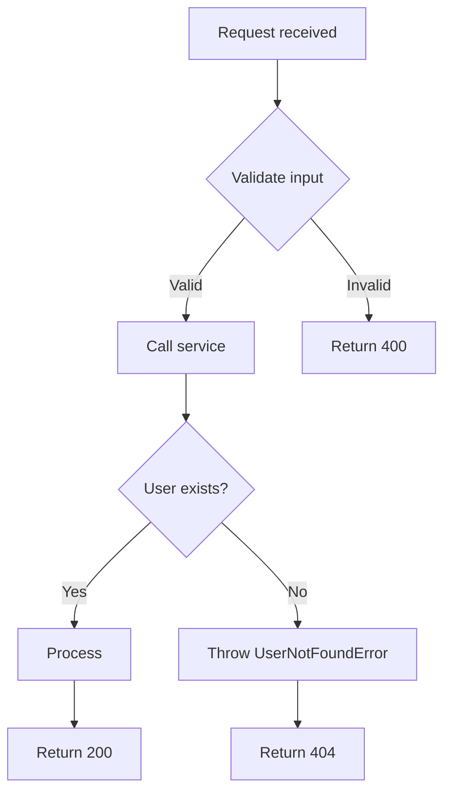
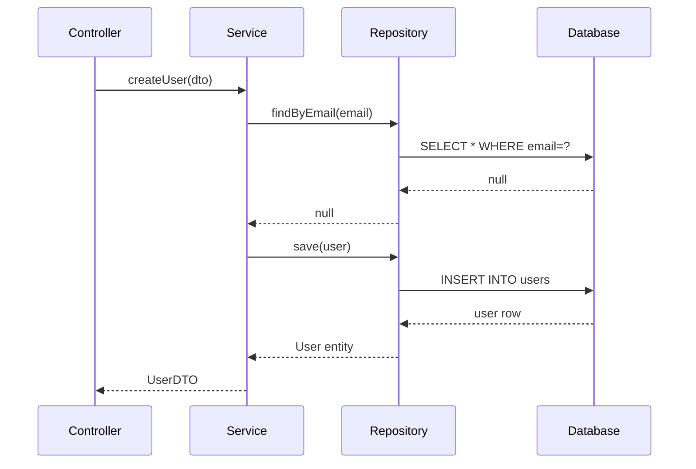
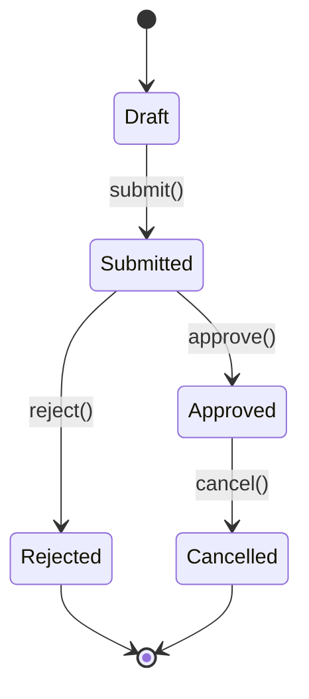

# Code Flow Diagram

Visualise how code executes — before implementing or to explain existing code.

## When to Use Each Diagram Type

| Type | Use For |
|---|---|
| Flowchart | Control flow, conditionals, loops |
| Sequence diagram | Inter-module/service communication |
| State diagram | Object/entity lifecycle |
| Data flow | How data transforms through layers |

## Diagram Format (Mermaid)

### Flowchart (control flow)


### Sequence Diagram (layer communication)


### State Diagram (entity lifecycle)


## Process

1. **Identify the scope** — one feature? one function? one layer?
2. **Choose diagram type** based on what needs to be shown
3. **Map the happy path** first
4. **Add edge cases and error paths**
5. **Annotate** key decision points and data shapes

## Output Format

Provide:
1. The diagram in Mermaid syntax (fenced with ` ```mermaid `)
2. A brief written description of the flow (2-5 sentences)
3. Key decision points called out explicitly

```
## Flow: [feature name]

### Diagram
[mermaid code]

### Description
[2-5 sentence walkthrough]

### Key Decision Points
- [condition] → [outcome]
- [condition] → [outcome]
```
